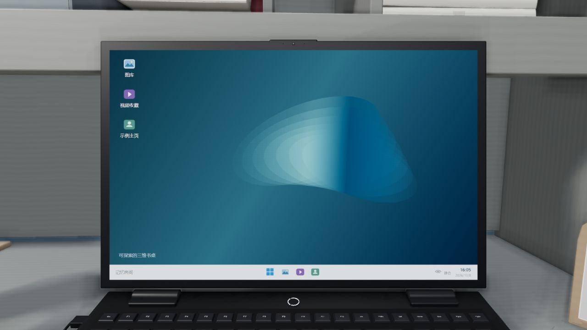

# Memory Room · 记忆房间

A self-contained 3D desk, reading room and object-inspection starter built with Three.js. Download the project, start a local server, and replace the included example content with your own.

一个以书桌为入口的三维网页示例：靠近书本、翻页阅读、拿起物件观察，也可以打开桌面电脑。适合学习 Three.js 交互，或改造成自己的作品集、阅读空间和数字展览。



**Status: initial public edition, v0.1.0.** This is an early project. It does not claim an established user base, production support, or affiliation with OpenAI or any product shown in earlier private prototypes.

## Run / 运行

Requires Node.js 22 or later and a browser with WebGL 2 enabled. Runtime dependencies and sample assets are bundled; no package installation, API key, account or backend is required.

```sh
node scripts/serve.mjs
```

Open **http://127.0.0.1:4173**. To choose another port:

```sh
node scripts/serve.mjs --port=4174
```

也可以在项目目录运行 `npm start`。请通过本地网址打开，直接双击 HTML 文件会受到浏览器模块和资源加载限制。开发服务器只监听本机；上线时将 `dist/` 文件夹作为静态网站发布即可，不要把整个项目目录暴露为文件服务。

## Explore / 使用

- Drag the room to look around; select a book or object to inspect it.
- Use the book controls to turn pages, open the contents and focus a single page.
- Return to the desk with the on-screen return control.
- The desk computer includes generic demonstration content.
- Keyboard users can tab to the room's object shortcuts and visible controls. Full keyboard access to every 3D object remains a roadmap item.

All sample writing, document cards, illustration placeholders and map regions are fictional. The map is an abstract journey diagram, not a real geographic dataset. Some internal filenames retain legacy names to avoid breaking scene interfaces; they do not indicate that game or brand assets are included.

## Useful parts to reuse

| Module | Purpose |
| --- | --- |
| `dist/book-collision.js` | Oriented-box collision checks and sampled movement-path verification |
| `dist/book-single-page-focus.js` | Single-page reading camera and layout helpers |
| `dist/home-viewport-policy.js` | Defers responsive room-camera changes until reading or inspection ends |
| `dist/object-inspector.js` | Picking and inspecting scene objects |
| `dist/toy-player.js` | Procedural object movement and optional animation handling |
| `dist/assets/` | Replaceable example books, documents, illustrations and GLB models |

See [customization](docs/CUSTOMIZATION.md), [asset provenance](ASSET_LICENSES.md), [maintenance](MAINTAINERS.md), and [contributing](CONTRIBUTING.md).

## Verify / 检查

```sh
node scripts/verify.mjs
node --test tests/*.test.mjs
```

The checks cover module syntax and imports, sample data, image-free GLB structure, geometry behavior and local-server path containment. They do not substitute for browser rendering and interaction tests. See [verification notes](docs/VERIFICATION.md) for the tested scope and current limitations.

## Development scope

The initial release focuses on a reusable interactive room and readable book content. Current limitations include a large single scene module, limited keyboard navigation for 3D objects, and performance sensitivity on low-power devices. The project contains no analytics or usage counter, so there is no measured adoption claim.

See [ROADMAP.md](ROADMAP.md) for concrete follow-up work. Contributions should include reproducible behavior, not inflated metrics or cosmetic activity.

## License

Project code and newly created example assets are MIT licensed. Three.js is MIT licensed; bundled fonts retain their SIL Open Font License notices. See [LICENSE](LICENSE) and [ASSET_LICENSES.md](ASSET_LICENSES.md).
